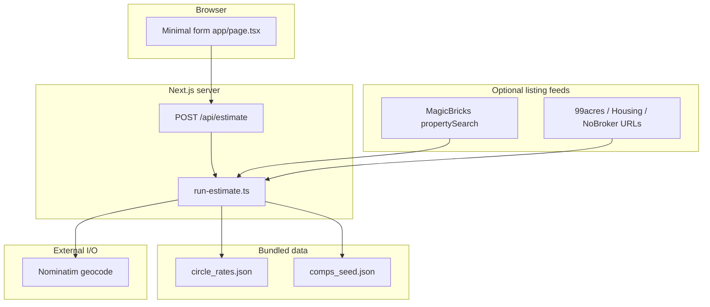

# Architecture — Collateral Valuation & Liquidity Engine

**Companion docs:** [`PROBLEM-4A-SPECIFICATION-AND-PLAN.md`](./PROBLEM-4A-SPECIFICATION-AND-PLAN.md) (PDF → spec & plan) · [`PROJECT-OVERVIEW.md`](./PROJECT-OVERVIEW.md) · [`PRD.md`](./PRD.md) · [README](../README.md)

---

## 1. Purpose

- **Next.js** (App Router) on **Vercel**, **server-only** secrets.
- **Outputs:** `market_value_range`, `distress_value_range`, `resale_potential_index`, `estimated_time_to_sell_days`, `confidence_score`, `key_drivers`, `risk_flags` (+ extended fields for comps/sources).
- **₹ values** come from **code + data** (rules, tables, comps). The pricing path is **fully deterministic** and auditable.

---

## 2. High-level diagram



---

## 3. Request / response (contract)

- **Validation:** `lib/schemas.ts` (`estimateRequestSchema` / `estimateResponseSchema`).
- **Main handler:** `app/api/estimate/route.ts` → `runEstimate()`.

**Key request groups**

| Group | Purpose |
|-------|---------|
| Core | `address` or `lat`/`lon`, `property_type`, `property_sub_type`, `size_sqft`, `age_bucket`, `comp_radius_km` |
| Adjustments | `floor`, `has_lift`, `legal`, `occupancy`, `rental_yield_percent`, `city_tier` |
| MagicBricks | `magicbricks.enabled`, `city_id`, `locality_id`, `search_url` |
| Other portals | `listing_feeds[]` — `{ provider: 99acres \| housing \| nobroker, enabled, search_url }` |
| Context | `collateral_context` — free text (keyword heuristics for drivers only) |

**Key response extensions**

| Field | Meaning |
|-------|---------|
| `data_sources[]` | e.g. `circle_rate_table`, `nominatim_geocode`, `comps_seed_radius`, `magicbricks_property_search`, `listing_feed_*` |
| `comps_breakdown` | Counts: seed, MagicBricks, 99acres, housing, nobroker in radius; optional raw fetch counts |
| `landmark_signals` | Coarse POI categories from MagicBricks `landmarkDetails` on comps in radius |
| `magicbricks_error` / `portal_feed_errors` | Fetch/parse failures (cookies, HTML vs JSON, shape mismatch) |
| `assumptions_version` | From `circle_rates.json` |

---

## 4. Valuation & liquidity (implementation)

- **Single orchestrator:** `lib/engine/run-estimate.ts` (not separate valuation.ts / liquidity.ts files — logic is inline for the demo).
- **Circle rate:** `lib/data/circle-rates.ts` reads `data/circle_rates.json`; city match on name hints from geocode/address; else tier fallback.
- **Model path:** floor ₹/sqft × tier + multipliers (type, sub-type, age, legal, floor/lift, occupancy) × `size_sqft`.
- **Comps:** `lib/comps/query.ts` — pool = seed JSON + extra listings from portals; **Haversine** filter; **median ₹/sqft**; blend with model (weights in code).
- **MagicBricks listings:** `lib/magicbricks/fetch-property-search.ts` — parses `resultList`; lat/lon from `pmtLat`/`pmtLong` or `ltcoordGeo`.
- **Other portals:** `lib/portals/fetch-portal-search-url.ts` + `lib/portals/normalize-json-listing.ts` — heuristic JSON paths and field aliases.
- **Landmarks:** `lib/magicbricks/landmarks.ts` — amenity score from comp `landmarkDetails`; nudges blended value / resale / liquidity (capped).
- **Distress / resale / days:** derived from tier, age, legal, comp density, portal comps, amenity score (see `run-estimate.ts`).

---

## 5. Geo radius

1. Subject must resolve to `(lat, lon)` (explicit or Nominatim).
2. Each comp has `lat`, `lon`, `price_inr`, `area_sqft`, optional `source`.
3. `haversineKm` ≤ `comp_radius_km` (defaults in UI often **8 km** for Pune demo).
4. Median ₹/sqft across comps in radius; blend with model; widen spread when confidence low or comps thin.

---

## 6. Tech stack

| Layer | Choice |
|-------|--------|
| Framework | Next.js 15, React 18, App Router |
| API | Route Handlers, `runtime = nodejs` for fetch (geocode, portals) |
| Validation | Zod |
| Styling | Tailwind (`app/globals.css` utility classes) |
| Data | Static JSON in `data/` (no DB required for v1) |

---

## 7. Deployment

- **Vercel:** connect repo; set env vars in project settings.
- Portal fetches are **on-demand** in the estimate request (keep URLs short; cookies in env).
- No heavy synchronous scrape beyond HTTP GET + JSON parse (timeout ~12s in portal helpers).

---

## 8. Risks & mitigations

| Risk | Mitigation |
|------|------------|
| Portal returns HTML / 403 | `portal_feed_errors` / `magicbricks_error`; seed comps still work |
| ToS on automation | Document in README/PRD; production → licensed data |
| Geocode wrong | User can paste lat/lon; confidence + flags |

---

## 9. Directory (as implemented)

```
app/
  page.tsx                 # Landing
  estimate/page.tsx        # E2E wizard + EstimateFormProvider
  api/estimate/route.ts
  layout.tsx
  globals.css
components/
  layout/AppShell.tsx
  estimate/
    EstimateWizard.tsx
    StepProgress.tsx
    ResultsPanel.tsx
    steps/StepLocation.tsx, StepProperty.tsx, StepAdvanced.tsx, StepReview.tsx
contexts/
  EstimateFormContext.tsx
lib/
  flow/types.ts
  flow/defaults.ts
  flow/build-estimate-body.ts
  format.ts
  engine/run-estimate.ts
  schemas.ts
  comps/query.ts
  data/circle-rates.ts
  geo/geocode.ts
  geo/haversine.ts
  magicbricks/
    fetch-property-search.ts
    landmarks.ts
    types.ts
  portals/
    listing-source.ts
    normalize-json-listing.ts
    fetch-portal-search-url.ts
data/
  circle_rates.json
  comps_seed.json
docs/
  PROJECT-OVERVIEW.md
  PRD.md
  ARCHITECTURE.md
```

---

## 10. Known limits

- Circle-rate table is **illustrative**, not exhaustive pan-India.
- Portal JSON **shapes change** — heuristic parsers may need updates per observed response.
- **Landmark** strings from MagicBricks are `code|name` (no per-POI lat/long in the sample we parse).

Keep this file in sync with [`PRD.md`](./PRD.md) and [README](../README.md).
