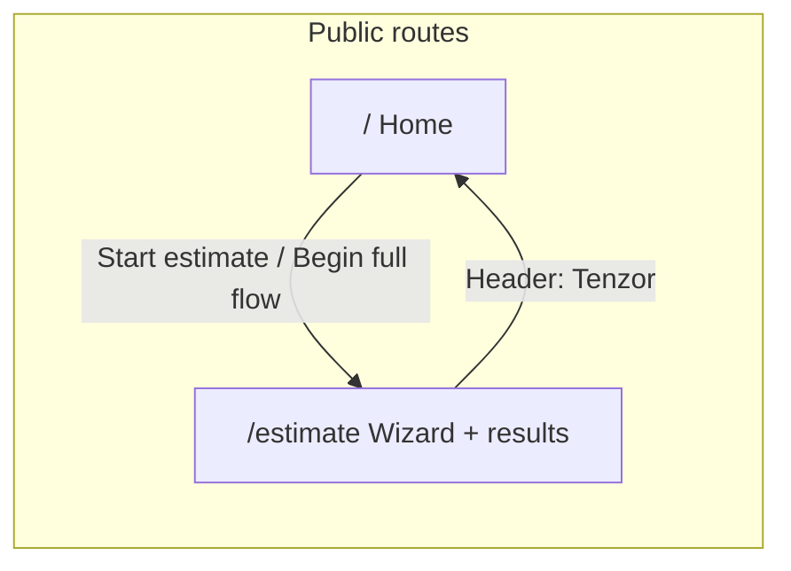
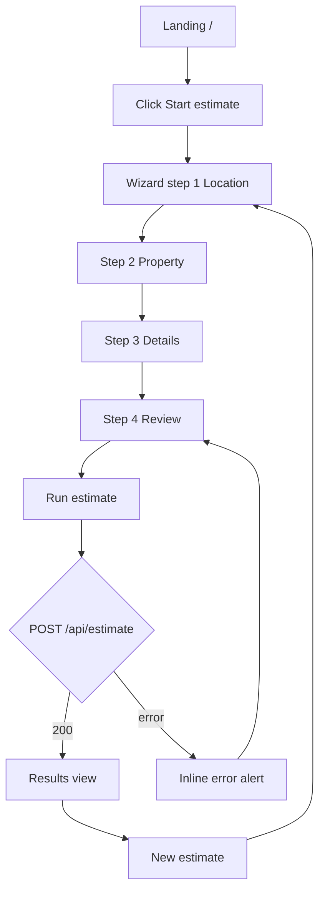

# Tenzor — UI/UX flow

This document describes the end-user interface and experience for the demo app: routes, the collateral estimate wizard, validation, feedback, and the results surface. It reflects the current implementation (Next.js App Router, Ark UI `Steps`, `Field`, `Checkbox`, `Collapsible`).

---

## 1. Goals and constraints

| Goal | How the UI supports it |
|------|-------------------------|
| Complete a collateral estimate without training | Linear wizard with four labeled steps and a persistent primary action (Continue / Run estimate). |
| Trust but verify | Review step summarizes inputs; results show ranges, confidence, comps count, drivers, and risk flags. |
| Demo / integration clarity | Disclaimers on marketing and estimate shells; optional raw JSON for developers. |

**Non-goals for this UI:** licensed appraisal workflow, saved accounts, or multi-collateral portfolios.

---

## 2. Information architecture

| Route | Purpose |
|-------|---------|
| `/` | Landing: value proposition, bullets, CTAs to `/estimate`. |
| `/estimate` | Full flow: wizard → API → results → new estimate. |

**Global chrome on `/estimate` (via `AppShell`):** header with brand link to `/`, nav links **Home** and **New estimate**, page title **Collateral estimate**, footer disclaimer.

---

## 3. Primary user journey

1. User lands on `/`, reads scope, clicks **Start estimate** or **Begin full flow**.
2. User completes four steps (or jumps via stepper triggers where allowed; see §5).
3. On **Review**, user runs **Run estimate** → loading overlay → success shows **Results** or failure shows **Error** above the wizard (if still on form — see §7).
4. From results, **New estimate** clears state and returns to step 1.

---

## 4. Screen inventory

### 4.1 Landing (`/`)

| Element | Behavior |
|---------|----------|
| Header | Brand “Tenzor”; primary **Start estimate** → `/estimate`. |
| Hero | Title, short description (market/distress ranges, resale index, TTL, optional comps & AI). |
| Bullets | Reinforce flow, engine, disclaimer. |
| **Begin full flow** | Secondary CTA style; same destination as header CTA. |
| Footer | Short legal/demo note. |

**UX:** Single clear path into the product; no form on this page.

---

### 4.2 Estimate shell (`/estimate`)

- **Max width:** `max-w-3xl`, comfortable reading width.
- **Title:** “Collateral estimate” under the header.
- **Content:** Either the wizard **or** the results block (mutually exclusive in code).

---

## 5. Wizard: structure and navigation

The wizard uses **Ark UI `Steps`** in **linear** mode with **four** steps (indices `0–3` mapped to user-facing steps `1–4`).

### 5.1 Progress (stepper)

- **Location:** Top of the form, `aria-label="Progress"`.
- **Visual:** Numbered circles (or ✓ when completed); labels **Location**, **Property**, **Details**, **Review** (labels visible from `sm` breakpoint up).
- **Interaction:** Each step is a **trigger** — in linear mode, forward jumps are blocked until the current step passes validation (`isStepValid`). Users can move backward via triggers or **Back**.

### 5.2 Footer actions

| Step | Primary (right) | Secondary (left) |
|------|-------------------|------------------|
| 1–3 | **Continue** (`Steps.NextTrigger`) | **Back** (`Steps.PrevTrigger`) |
| 4 Review | **Run estimate** (custom button) | **Back** |

- **Back** on step 1 is disabled (and cannot go before step 1).
- **Continue** uses the same validation as the linear stepper (steps 1–2 must pass before advancing).

### 5.3 Validation rules (client)

| Step | Gate | User-facing hint |
|------|------|------------------|
| 1 Location | Either non-empty **address**, **or** valid **lat** + **lon** (numeric, within geographic bounds). | Amber text under the footer when invalid on steps 1–2. |
| 2 Property | **Size (sqft)** must be a positive number. | Same amber line. |
| 3–4 | No field-level gate for Continue beyond stepper. | — |

Server-side validation and errors from `/api/estimate` appear in the **red alert** (§7).

---

## 6. Step content (field-level UX)

### Step 1 — Location

- Short intro copy (circle rates, comps radius).
- **Address** (textarea), **Latitude** / **Longitude** (mono inputs), **Comp radius (km)**, **City tier fallback (1–3)** — Ark UI **Field** (label + control), underline-style inputs (`field` class).

### Step 2 — Property

- Intro: type, size, age.
- **Property type** / **Sub-type** (selects), **Size (sqft)** (number), **Age bucket** (select). **Field** + **Field.Select** with `field-select` styling.

### Step 3 — Details

- Intro: legal, occupancy, feeds, notes.
- **Floor** (number), **Lift access** (**Checkbox**).
- **Tenure**, **Title clarity**, **Occupancy**, **Rental yield %** (selects / number).
- **AI summary** (**Checkbox**); server-side key required for AI text in results.
- **Listing feeds (optional)** — **Collapsible** (collapsed by default): MagicBricks toggles + optional IDs/URL; other portals with URL fields; checkboxes per feed.
- **Collateral context:** three **Field.Textarea** blocks (location notes, legal/RERA, documents summary).

### Step 4 — Review

- Intro: confirm before server run.
- Read-only **definition list** of key inputs (address, coordinates, radius, property line, legal, occupancy).

---

## 7. States and feedback

### 7.1 Loading

- When the estimate request is in flight: **semi-transparent overlay** on the step area with **“Running estimate…”**; primary actions respect `disabled` while submitting.

### 7.2 API error (wizard still visible)

- **Red alert** (`role="alert"`) above the step content with the error string; user can fix inputs or retry from **Review**.

### 7.3 Success — Results

The wizard is replaced by:

1. **Progress strip** showing all steps complete with an extra **Results** marker (visual completion).
2. **`ResultsPanel`:** primary card with **Market value**, **Distress value**, **Resale index**, **Time to sell (days)**, **Confidence**, **Comps** (count + radius), optional **Comps split**, **Landmark signals**, portal errors if any.
3. Optional **resolved location** JSON block (mono).
4. **Drivers** and **Risk flags** (bulleted lists).
5. Optional **AI summary** (highlighted card) when returned.
6. **Raw JSON** `
` for debugging.
7. **`assumptions_version`** footnote.
8. **New estimate** resets form and returns to step 1.

---

## 8. Responsive and visual patterns

- **Breakpoints:** Step labels in the stepper hide on very small screens; numbers/✓ remain visible.
- **Theme:** Light/dark via system preference (`prefers-color-scheme`) and neutral palette; **primary** actions dark/neutral, **Run estimate** emerald, **success/completed** steps emerald accents.
- **Density:** `max-w-3xl` main column; grids two columns on wider viewports for short fields.

---

## 9. Accessibility notes

- Progress is a **nav** with accessible name.
- Step errors for API responses use **`role="alert"`**.
- Ark **Field** associates labels with controls; **Steps** expose appropriate roles for the stepper pattern.
- **Collapsible** and **Checkbox** use Ark primitives; focus styles on step triggers (`focus-visible:ring`).

---

## 10. Open UX considerations (future)

- **Geocoding feedback:** No inline map or “resolved address” preview until results — could add a preview on Location or Review.
- **Step 3 length:** Many optional fields — consider sub-sections or progressive disclosure beyond the single collapsible.
- **Results:** Export PDF/CSV and copy-to-clipboard are not implemented.

---

## 11. Related docs

- `docs/PRD.md` — product intent and scope.
- `docs/ARCHITECTURE.md` — technical structure and API.
